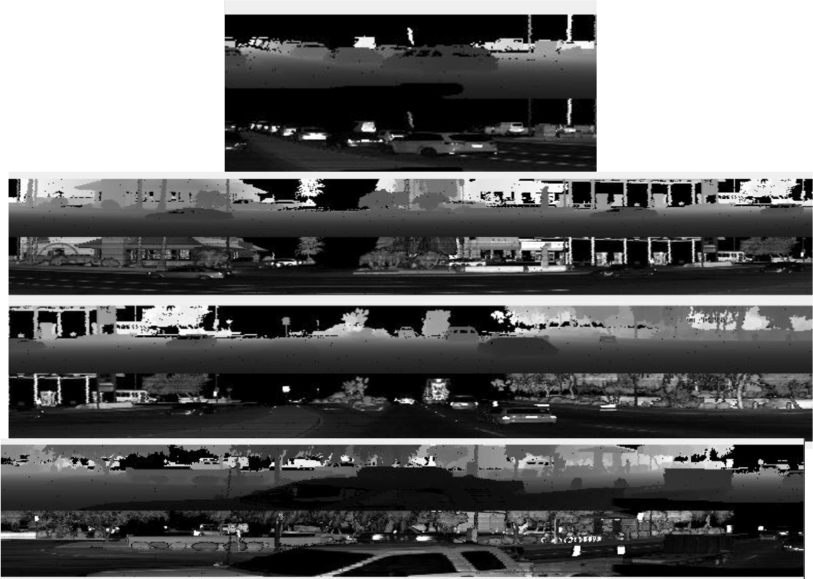
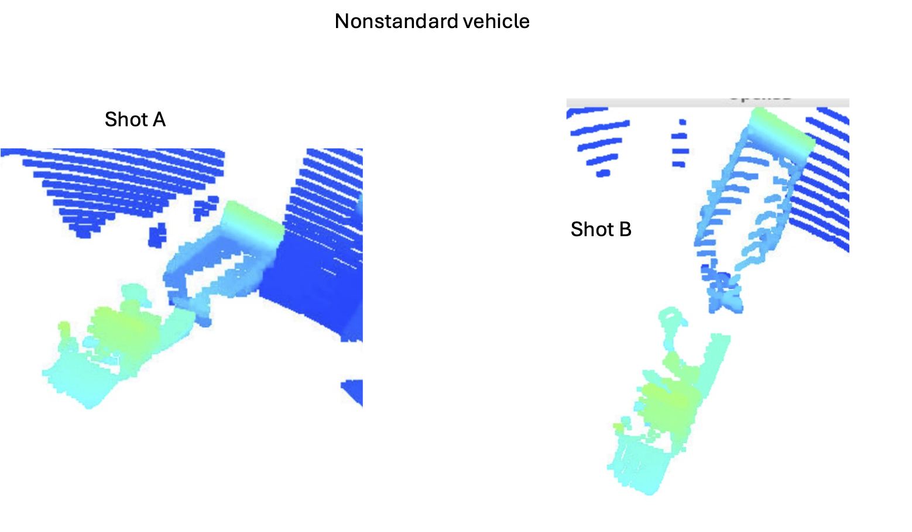
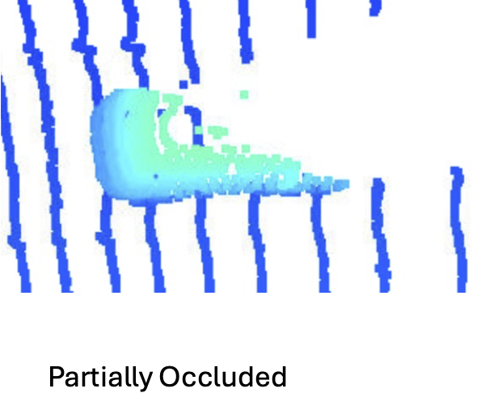
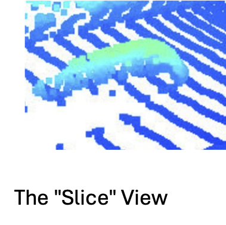
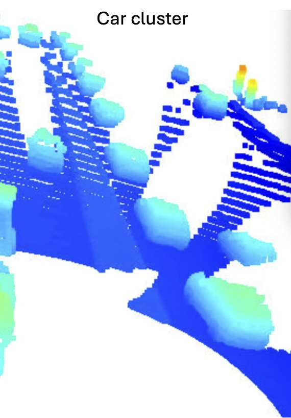
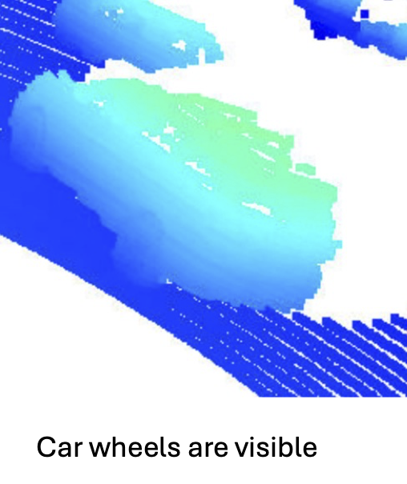
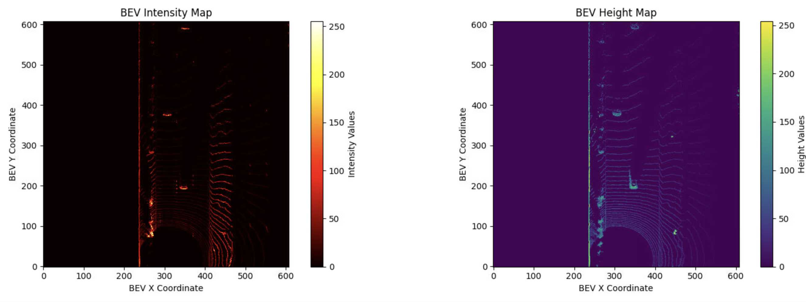
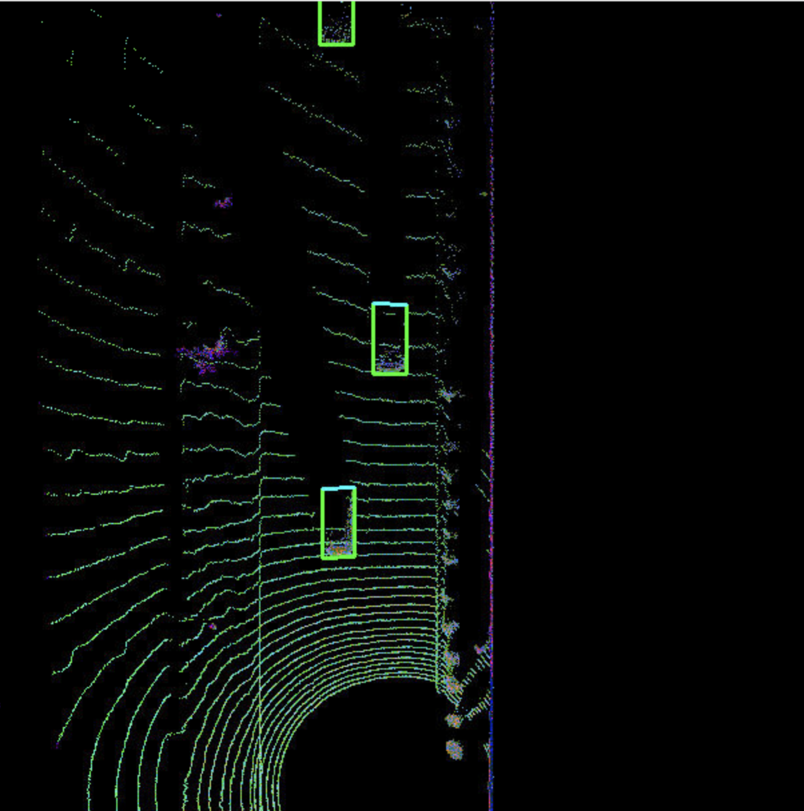
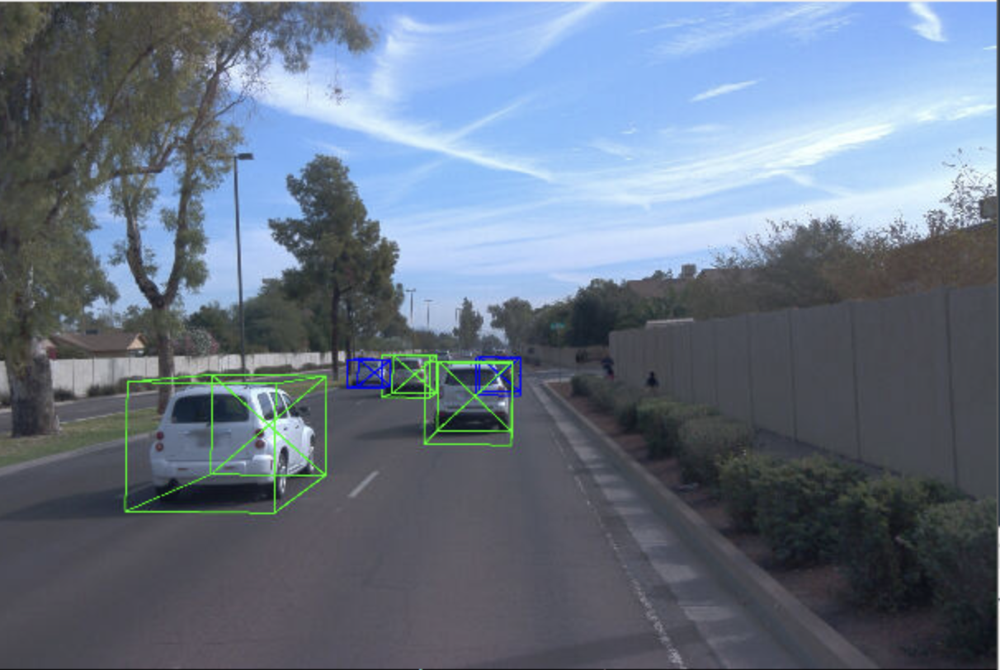

# Mid-Term Project: 3D Object Detection

This report details the findings for the mid-term portion of the project, focusing on point cloud analysis and feature identification.

## Part 1: Vehicle Examples with Varying Visibility

The LiDAR sensor does not directly perceive a 3D world. Its native output is a **range image**, which is a 2D projection of the surrounding environment. It can be thought of as a panoramic, distorted photo where each pixel contains information about distance and reflectivity rather than color.

This project utilizes a two-channel range image:

1.  **Range Channel:** Shows the distance from the sensor to an object for each laser beam.
2.  **Intensity Channel:** Shows how much of the laser's light was reflected back by the object's surface.

*Above: A visualization of the LiDAR data. The top image is the range channel (distance), and the bottom is the intensity channel (reflectivity).*

The intensity channel is particularly valuable. While the range channel builds the scene's geometry, the intensity channel reveals the material properties of the objects. Notice the small, intensely bright white spots in the intensity image. These are high-reflectivity surfaces, which are key to identifying certain features.

Below are six examples of vehicles captured from the LiDAR point cloud, demonstrating a range of visibility conditions from ideal to challenging.

---

**1. Non-standard vehicle**

*We can see a truck towing a trailer. This is visible in the range and intensity plots in the bottom pannel*

---

**2. Distant Vehicle**

*This vehicle is significantly farther away, resulting in a much sparser point cloud. The car's specific shape is less defined, demonstrating the challenge of long-range detection.*

---

**3. Partially Occluded Vehicle**

*Here, the target vehicle is partially hidden behind another object. Only a fraction of its side is visible, highlighting how occlusion leads to incomplete data.*

---

**4.  Sliced Vehicle**

*Here, the target vehicle is half hidden because of the lidar geometry of sensing*

---

**5. Car Clusters**

*Cars can cluster together when they are far from the lidar*

---

**6. Visible Car Wheels**

**Geometric Features:** Across the examples, the most stable geometric feature is the **flat, vertical rear surface** of a vehicle (trunk or tailgate). This consistently appears as a dense, planar cluster of points.

**Connecting to Intensity:** This geometric finding is strongly supported by the LiDAR intensity channel (shown in the range image plot). The rear of a vehicle consistently shows a small cluster of **intensely bright pixels**, corresponding to the **retroreflective license plate and tail lights**. This intensity signature is a highly reliable feature for confirming that a car-shaped object is indeed a vehicle.
*The car wheel geometry is particularly prominant in this close scan*

## Part 2: Birds Eye View Intensity and Height Maps

Birds-eye view (BEV) maps transform 3D lidar point clouds into 2D top-down representations for object detection.

**BEV Intensity Map**: Projects lidar reflectivity values onto a 2D grid. For each grid cell, the intensity value of the topmost lidar point is assigned, representing surface material properties (metal appears bright, dark paint appears dim).

**BEV Height Map**: Projects elevation data (z-coordinates) onto the same 2D grid. Each pixel represents the height above ground of the topmost surface at that location.

Both maps use identical processing: coordinate transformation to BEV space, sorting by height to select topmost points, and normalization to 0-255 range. The combination provides both geometric (height) and material (intensity) information for robust object detection.

## Part 3: Model-based Object Detection

We apply an object detection and classification model to the BEV data. This model is a CNN Feature Pyramid Network with a Resnet backbone. This facilitates multi-scale detection.

The model expects three BEV channels: intensity, height, and point density. 

The data workflow is the following:

Lidar Point Cloud (3D)
    ↓
BEV Coordinate Transform  
    ↓
3-Channel BEV Map (2D Image)
[Intensity | Height | Density]
    ↓
CNN (FPN + ResNet)
    ↓
Feature Maps at Multiple Scales
    ↓
Detection Head
    ↓
3D Bounding Boxes in BEV Space

Bounding boxes are defined in terms of (x,y,z) coordinates of the box datum, yaw offset from the direction of the sensing vehicle, and the box width, length, and height, as well as the class of the object being bounded. In this example, we only focus on detected cars An example of this classiciateion is shown below. The green boxes are considered confirmed/high-confidence car sightings. The blue boxes are potential car sightings, which are relevant for tracking these objects across multiple frames. 

Here are the bounding boxes found in BEV space:

And here they are projected in the camera's coordiante system:

